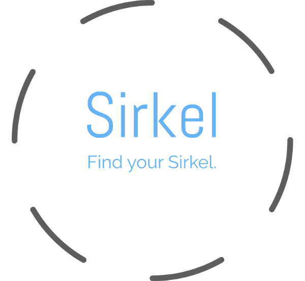

<h1 align="center">Team 27</h1>

  Content |
  ------------ 
  [Project Charter](#project-charter)|
  [Project Backlog](#product-backlog)|

# Project Charter

## Team Members:
* Elijah Smith
* Dan Hipskind
* Adam Lula 
* Tianchi Xu
* Trevor Neidlinger

## Problem Statement:
While Purdue boasts more than 1000 clubs and student organizations,  there still is no easy way to navigate them. Sure, there are platforms to find these clubs (BoilerLink, Facebook groups, club fairs, etc.), but these all lack a sophisticated way to find the organizations they would be most interested in. Furthermore, with over 30,000 undergrads it can be overwhelming, for Freshmen in particular, to find individuals who share their interests (potentially obscure enough for there to not be a club already). While plenty of students find their group at Purdue, there are still many that don’t and that’s a substantial reason for many students to dropout.

## Project Objectives:
Gather information from users and organizations to facilitate matching.
Gather basic club and organization information from a purdue database (or potentially a web scraper?).
Rank and recommend organizations to the user.
Create friend recommendations for users based on interests and personality.
Create a basic line of communication for users and organizations.
Create a filtered feed of activities for each user based on interests.
Allow organizations to reach out and find members that may be interested in them.

## Stakeholders:
* Project Owners: Elijah Smith, Dan Hipskind, Adam Lula, Tianchi Xu, and Trevor Neidlinger
* Developers: Elijah Smith, Dan Hipskind, Adam Lula, Tianchi Xu, and Trevor Neidlinger
* Users: Students (Freshmen in particular) and Clubs/Organizations of Purdue
* Project Coordinator: Lakshay Kharbanda

## Project Deliverables:
* Matching algorithm that will match users with organizations and other students of Purdue based upon interests, personality, and other   biographical features.
* A web application using ReactJS for the user interface.
* NodeJS with Express backend web application.
* MongoDB to store user and organization information.
* PassportJS supported authentication to keep user credentials safe.
* An activities feed for users supported by Redis.

# Product Backlog

Dan Hipskind, Eli Smith, Trevor Neidlinger, Tianchi Xu, Adam Lula

**Problem Statement**

Arriving at Purdue for the first time is both exciting and potentially anxiety inducing. Many people find friends and organizations quickly, but there are plenty that don’t; they struggle to find their place. Our project aims to help these students in particular connect to organizations and other people that they might connect with. The platform will enable students to find actual organizations/people that match their interest and personality efficiently. 

**Background Info:**

**Audience**

At large universities like Purdue, it can be intimidating for students to find organizations and people that they relate with. Furthermore, it can be difficult to create new clubs and attract interest when there are so many existing organizations.  There is a need for an efficient application to help these entities easily connect.

**Similar Platforms**

There are two platforms in particular that are similar to our project. They each contain certain features of our project, but fail to create an easy and efficient process for connecting students and organizations. These two services are Facebook and Boilerlink for Purdue specifically.

**Limitations**

While there are already places where you can find Purdue clubs and activities, they are limited by not being able to suggest clubs to students. Boilerlink, which lists the organizations, is rarely used by organizations and often contains outdated information. It is more of an archive than a dynamic platform. Moreover, Facebook lacks the focus that we are aiming for and is arguably bloated for the purpose at hand. We believe that a student should be able to fill out a short survey that will be used to suggest clubs to a student that may interest them. We think we can allow students and organizations to connect much more efficiently with our more specialized and polished product.

**Functional Requirements:**

1. As a user, I would like to be able to register for an account.

2. As a user, I would like to be able to login and manage my account.

3. As a user, I would like to be able to create an event.

4. As a user, I would like to be able to use the service on any device.

5. As a user, I would like to be able to reset my password if necessary.

6. As a user, I would like to be able to find other users with similar interests.

7. As a user, I would like to be able to have a easy to use interface.

8. As a user, I would like to be able to access the website on different screen sizes.

9. As a user, I would like to be able to have reputation points

10.  As a user, I would like to verify my email address.

11.  As a student, I would like to be able to see a list of clubs on campus.

12.  As a student, I would like to be able to get suggestions for clubs that I might like.

13.  As a student, I would like to be able to connect with other students.

14.  As a student, I would like to be able to get notification if there is a new match.

15.  As a student, I would like to be able to meet up on campus with other students.

16.  As a student, I would like to be able to connect with a club page and receive info from them.

17.  As a student, I would like to be able to take a quiz to be matched with things that interest me

18.  As an organization, I would like to be able to create a public profile.

19.  As an organization, I would like to be able to list information on a webpage.

20.  As an organization, I would like to be able to post about upcoming events.

21.  As an organization, I would like to be able to reach a large audience.

22.  As an organization, I would like to be able to reach out directly to students who may be interested in my club.

23.  As an organization, I would like to be able to have access to information about University club regulations.

24.  As an organization, I would like to be able to set the role and the status for students in my organization.

25.  As an organization, I would like to be able to see which and how many students plan to attend an event.

26.  As an organization, I would like to be able to be able to see which members have paid their clubs dues.

27.  As an organization, I would like to be able to send reminders to members who who still need to pay club dues.

**Non-Functional Requirements:**

**Architecture and Performance**

We plan to start development by having separated the frontend from the backend. This will allow us more flexibility in the future if we want to expand to other platforms such as Android, and IOS. Separating them will also allow us lessen our compatibility issues if they were to arise and find them quicker. The backend will be written in NodeJS with Express. This makes routing very simple. Our backend architecture will follow REST. We will also be utilizing MongoDB for our database needs. This choice of database allows for more flexible data and can be very cleanly integrated into our NodeJS application. 

Our applications frontend will be developed with ReactJS. Our frontend will interact with our backend via API calls. We may potentially use React Native to expand our platform to mobile devices.

**Security**

Security is an essential part of Sirkel, both online and in the real world. Online there will be individual profiles of people that can contain sensitive information and will need to be password protected among other things. We will have constant reminders on the site warning people that they are meeting strangers and to do so in public spaces where there are many people around. We will also restrict the scope to Purdue students. To ensure this, users will need to sign up with their Purdue email address.

**Usability**

Sirkel’s user interface should be practical and easy to navigate for any student. It should not have a steep learning curve, but rather be intuitive to the average user who may not have as much experience with technology. This will ensure that users will have a pleasant and efficient experience when searching for new clubs or looking at information from clubs they have already joined. To make account creation incredibly simple we plan to use the student Purdue Login in order to gather initial basic account information and decrease the number of forgotten passwords. This will also ensure that each student has only one account and organization accounts do not get spammed by fake users.  As an organization page owner, the interface should contain more options and administrative privileges, but remain equally as efficient and intuitive. This will allow them to use time reaching new students and progressing their organization rather than getting frustrated with a clunky UI. We would also like anyone to be able to access our product regardless of browser type or screen size. This ensures that each student is receiving an opportunity to become involved on campus.

**Hosting/Deployment**

We will be hosting our project on our personal computer at first during development and testing. Once we have a mature product and more users, we can deploy it to DigitalOcean or Heroku. For database, we are going to use MongoDB and we can choose mLab or MongoDB Atlas as cloud solution.